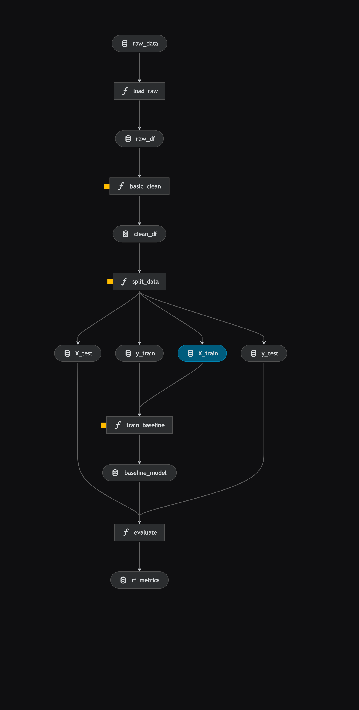

# Game Review Ratio

https://www.kaggle.com/datasets/artermiloff/steam-games-dataset?resource=download\&select=games\_march2025\_full.csv

Released under MIT License Downloaded - 07.10.2025 r.

### Selected metric: RMSE

Our target is the percentage of positive reviews, so RMSE allows better control over large prediction errors for games with unusual results. Since the error function squares the difference between the predicted and actual values, RMSE penalizes large errors more strongly than small ones.

### W&B: 
https://wandb.ai/zurek-jakub-polsko-japo-ska-akademia-technik-komputerowych/gamereviewratio?nw=nwuserzurekjakub

### Kedro quickstart:
```
kedro run
```
### Kedro pipeline

